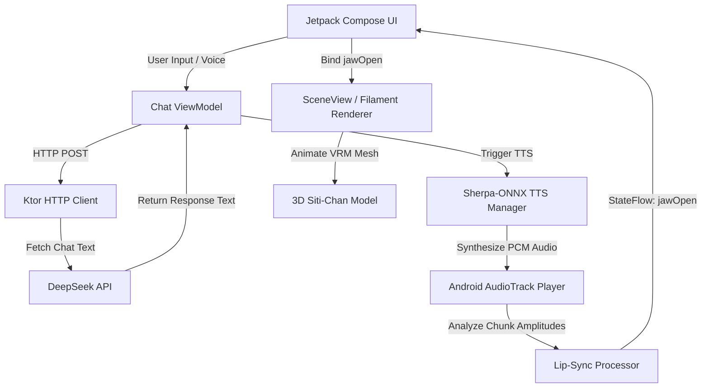

# Design Spec: Native Android Siti-Chan AI with Local Kokoro TTS

Design specification for creating a new native Android application (`siti-chan-android`) that implements the 3D Anime AI Companion entirely on-device for TTS (Kokoro via Sherpa-ONNX), with a native 3D avatar viewport (SceneView/Filament) and a DeepSeek LLM chat client.

---

## 1. Objectives & Requirements

### Key Features
*   **On-Device Kokoro TTS**: Run Kokoro-82M (quantized int8) locally via the `sherpa-onnx` framework. No external APIs will be used for speech generation.
*   **Model Downloader**: Keep the APK size small (~15MB) by downloading the model files (~350MB total) on first launch to the app's internal filesystem.
*   **Native 3D Avatar Rendering**: Load and display the `siti-chan.vrm` model using the **SceneView** library (a high-level Jetpack Compose wrapper for Google's Filament 3D engine).
*   **Real-time Lip-Sync**: Extract the Root Mean Square (RMS) amplitude from the playing PCM audio track in real-time, scale it, and apply it directly to the VRM mouth-open morph target (BlendShape).
*   **DeepSeek LLM Integration**: Call the DeepSeek API directly via HTTP (using Ktor Client) with a customizable API key.
*   **Native STT**: Implement voice input using Android's built-in `SpeechRecognizer` service.

---

## 2. System Architecture



### Components

1.  **`MainActivity` & Navigation**: The single-entry activity hosting the Jetpack Compose navigation. Coordinates the initial setup state (checking for model files) and navigates between the Download/Setup screen and the main Chat screen.
2.  **`ModelDownloadManager`**: Handles downloading `model.onnx`, `voices.bin`, `tokens.txt`, and extracting `espeak-ng-data` to `context.filesDir/kokoro/` with standard Ktor HTTP chunk downloads.
3.  **`SherpaOnnxTtsManager`**: Wraps the native `sherpa-onnx` library. Operates in a background thread pool (Coroutine Dispatcher) to synthesize speech without blocking the UI thread.
4.  **`AudioPlaybackManager`**: Utilizes Android's low-level `AudioTrack` to stream and play the 24kHz float/PCM 16-bit audio output from the TTS engine. Reads playback chunk values to compute audio power (RMS).
5.  **`SpeechToTextHelper`**: Configures and interacts with Android's system `SpeechRecognizer`.
6.  **`ChatViewModel`**: Retains state for chat messages, API keys, active speech voices, loading states, and processes text-to-speech requests.

---

## 3. Detailed Component Specifications

### 3.1 Model Downloader & Storage
*   **Storage Location**: `context.filesDir.absolutePath + "/kokoro_model/"`
*   **Required Files**:
    *   `model.onnx`: The quantized Kokoro weights.
    *   `voices.bin`: Vector database containing voice styles.
    *   `tokens.txt`: Mapping file for tokenizer tokens.
    *   `espeak-ng-data/`: Local folder containing rule files for phonemization.
*   **Download Source**: Pre-configured URLs (e.g. Hugging Face files).
*   **Flow**:
    *   On start, verify if all 4 items exist.
    *   If not, transition to `DownloadProgressScreen` which downloads and decompresses assets.

### 3.2 Local TTS Engine (`sherpa-onnx`)
*   **Dependency**: `com.k2fsa.sherpa.onnx:sherpa-onnx-android`
*   **Initialization Config**:
    ```kotlin
    val kokoroConfig = OfflineTtsKokoroModelConfig(
        model = "$modelDir/model.onnx",
        voices = "$modelDir/voices.bin",
        tokens = "$modelDir/tokens.txt",
        dataDir = "$modelDir/espeak-ng-data"
    )
    val config = OfflineTtsConfig(
        model = OfflineTtsModelConfig(
            kokoro = kokoroConfig,
            numThreads = 2
        )
    )
    val tts = OfflineTts(config = config)
    ```
*   **Generation**:
    ```kotlin
    val audio = tts.generate(text = text, sid = voiceIndex, speed = 0.8f)
    // audio.samples contains FloatArray of PCM values
    ```

### 3.3 Audio Player & Lip-Sync Envelope Follower
*   **Player**: Uses `AudioTrack` to play the float samples directly or converted to Short (16-bit PCM).
*   **Lip-Sync Extraction**:
    *   As the play buffer is processed in chunks of size $N$ (e.g., 512 samples at 24kHz $\approx 21\text{ ms}$):
    *   Calculate RMS:
        $$RMS = \sqrt{\frac{1}{N} \sum_{i=1}^N x_i^2}$$
    *   Smooth the output via a lerp function (envelope follower) with quick attack (increase) and slow decay (decrease):
        ```kotlin
        val target = (rms * gain).coerceIn(0f, 1f)
        smoothedJawOpen = if (target > smoothedJawOpen) {
            smoothedJawOpen + (target - smoothedJawOpen) * attackRate
        } else {
            smoothedJawOpen + (target - smoothedJawOpen) * decayRate
        }
        ```
    *   Expose `smoothedJawOpen` through a Kotlin StateFlow (`jawOpenFlow`).

### 3.4 3D Viewport (`SceneView`)
*   **Dependency**: `io.github.sceneview:sceneview:4.0.0`
*   **VRM Assets**: Place `siti-chan.vrm` inside the project's `app/src/main/assets/` directory.
*   **Compose Setup**:
    ```kotlin
    SceneView(
        modifier = Modifier.fillMaxSize(),
        engine = engine,
        modelLoader = modelLoader,
    ) {
        val modelInstance = rememberModelInstance(modelLoader, "siti-chan.vrm")
        
        LaunchedEffect(jawOpen) {
            modelInstance?.let { instance ->
                // Apply morph target (blendshape) weights for vowel 'A' (Mouth Open)
                val faceMeshEntity = instance.findEntity("Face") // or target mesh name
                instance.setMorphBlendShape(faceMeshEntity, 0, jawOpen)
            }
        }
    }
    ```

### 3.5 DeepSeek Network Integration
*   **Client**: Ktor Client with ContentNegotiation (Kotlinx Serialization).
*   **Payload**:
    ```json
    {
      "model": "deepseek-chat",
      "messages": [
        { "role": "system", "content": "System prompt for Siti-Chan..." },
        { "role": "user", "content": "..." }
      ],
      "temperature": 0.7,
      "max_tokens": 150
    }
    ```

---

## 4. UI Design & Themes

*   **Color Palette**: Dark-mode premium layout matching the original web page (Deep dark blue/gray backgrounds `#0B0F19`, neon cyan `#00F2FE`, hot pink `#FF0844` gradients for buttons and accents).
*   **Layout**:
    *   **Top 50%**: Viewport holding `SceneView` for the 3D model, with floating controls (Settings gear).
    *   **Bottom 50%**: Scrollable message bubbles and chat bar.
*   **Settings Dialog**: Custom sheet storing:
    *   Custom DeepSeek API key.
    *   Selected speaker voice (e.g. `af_v0irulan`, `af_heart`, etc.).

---

## 5. Verification & Testing Plan

### 5.1 Manual Verification
1.  **First Launch Testing**: Clear app data, open the app, and verify that the download screen displays progress and successfully extracts model assets.
2.  **Network-Offline Test**: Turn off Wi-Fi/data after models are loaded, and verify that TTS works locally (text input generates audio offline).
3.  **Visual Lip-Sync Test**: Trigger a response, watch the 3D avatar, and confirm that the mouth openings correspond to the speech volume changes.
4.  **Settings Storage Test**: Set a custom API key and voice preference, restart the app, and verify that they are correctly retrieved.
